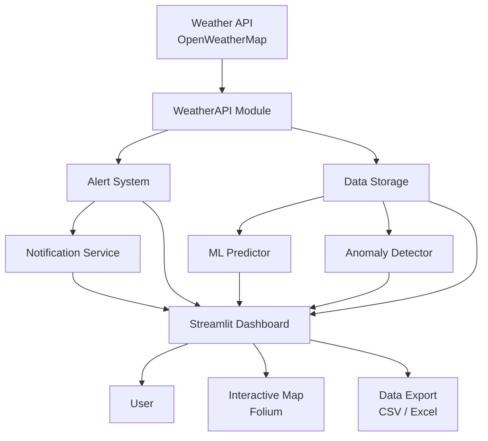

# Short-Term Rainfall Forecasting & Alert System

A real-time rainfall monitoring and alert system with machine learning forecasting, anomaly detection, and an interactive Streamlit dashboard.

## Assignment Objective

Build a functional short-term rainfall monitoring system that integrates external weather APIs, implements threshold-based alerting logic, and displays results through a professional web dashboard. The system supports multi-city monitoring, ML-based rainfall prediction, anomaly detection, interactive mapping, and notification services.

## System Architecture



## Features

- **Real-time Weather Data**: Fetch current weather from OpenWeatherMap API for multiple cities
- **Offline Mode**: Synthetic rainfall generation for demonstration without internet
- **Threshold-based Alerts**: GREEN (< 10 mm/h), YELLOW (10-20 mm/h), RED (≥ 20 mm/h)
- **Multi-City Monitoring**: Compare rainfall, temperature, and alerts across Beijing, Shanghai, Guangzhou, Shenzhen, Wuhan
- **ML Rainfall Forecasting**: Linear regression model predicting 1-hour and 3-hour rainfall
- **Anomaly Detection**: Z-score based detection of unusual rainfall events
- **Interactive Map**: Folium map with color-coded markers for each city
- **Notification System**: Email/SMS alert framework (configurable)
- **Data Export**: Download historical data as CSV or Excel
- **Auto-refresh**: Configurable automatic data refresh

## Installation

```bash
# Clone the repository
cd Rainfall_Alert_System

# Install dependencies
pip install -r requirements.txt
```

## Configuration

Copy the example environment file and configure:

```bash
cp .env.example .env
```

Edit `.env` with your settings:

| Variable | Description | Required |
|---|---|---|
| `OPENWEATHERMAP_API_KEY` | Free API key from openweathermap.org | No (offline fallback) |
| `REFRESH_INTERVAL` | Dashboard auto-refresh in seconds | No (default: 300) |
| `ENABLE_OFFLINE_MODE` | Synthetic data generation | No (default: true) |
| `ENABLE_EMAIL` | Email notifications | No (default: false) |
| `ENABLE_SMS` | SMS notifications via Twilio | No (default: false) |

## Running the System

### Streamlit Dashboard (Recommended)

```bash
streamlit run weather_monitor.py
```

### CLI Mode

```bash
python weather_monitor.py --cli
```

## Dashboard Overview

| Section | Description |
|---|---|
| Current Weather | Real-time rainfall, temperature, humidity, pressure, wind |
| Alert Center | Color-coded alerts with history log |
| Multi-City Monitoring | Compare all monitored cities with rankings |
| Historical Trends | Rainfall and temperature over time with moving averages |
| ML Forecast | 1h/3h rainfall predictions with confidence scores |
| Data Analytics | Distribution analysis, statistics, alert frequency |
| Anomaly Detection | Z-score analysis with severity classification |
| Notification Center | Send and track alert notifications |
| Interactive Map | Folium map with city markers and popups |

## Machine Learning Forecasting

- **Model**: Linear Regression (scikit-learn)
- **Features**: Temperature, humidity, pressure, 3 lagged rainfall values
- **Target**: Next-hour rainfall intensity
- **Retraining**: Automatic when 50+ new records are available
- **Confidence**: Based on model R² score
- **Uncertainty**: 95% confidence intervals via prediction with uncertainty

## Anomaly Detection

- **Method**: Z-Score analysis
- **Threshold**: |z| > 2 (configurable)
- **Severity Levels**: normal, high, extreme
- **Batch Detection**: Analyze entire history dataframe
- **Real-time**: Per-reading analysis on dashboard

## Testing

```bash
pytest tests/ -v
```

With coverage:

```bash
pytest tests/ --cov=app -v
```

## Results

The system provides:
- Real-time rainfall intensity for up to 5 Chinese cities
- Color-coded alert levels with persistent logging
- ML-based 1-hour and 3-hour rainfall forecasts
- Anomaly detection for unusual weather events
- Interactive map visualization
- Complete data export capabilities

## Future Improvements

- Add more sophisticated ML models (Random Forest, LSTM)
- Implement probabilistic forecasting with uncertainty quantification
- Add radar data integration for improved nowcasting
- Extend to global city coverage
- Implement push notifications via mobile app
- Add historical trend analysis with seasonal decomposition
- Implement user authentication for multi-user support
