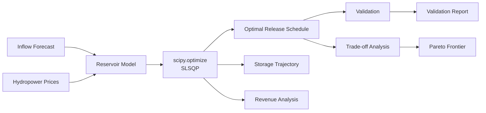

# Reservoir Dispatch Optimization

Multi-objective reservoir operation optimization during drought conditions. Balances hydropower revenue with ecological flow requirements using `scipy.optimize`.

## Problem Overview

A reservoir must optimize a 7-day release schedule to maximize hydropower revenue while maintaining minimum ecological flow, subject to physical storage and release constraints.



## Mathematical Formulation

### Decision Variables
- Q₁, Q₂, ..., Q₇: Daily release rates (m³/s)

### Objective Functions
1. **Maximize Hydropower Revenue**
   - Revenue = Σᵢ Qᵢ × Pᵢ × C
   - where Pᵢ = electricity price, C = conversion constant

2. **Minimize Ecological Deficit**
   - Deficit = Σᵢ max(0, Q_eco - Qᵢ)
   - where Q_eco = minimum ecological flow (10 m³/s)

3. **Combined (Weighted Sum)**
   - f = -w_r × Revenue + w_e × Deficit

### Constraints
| Constraint | Expression |
|---|---|
| Storage bounds | V_min ≤ V_t ≤ V_max |
| Release bounds | Q_eco ≤ Q_t ≤ Q_max |
| Mass balance | V_{t+1} = V_t + (I_t - Q_t) × Δt |

### Parameters
| Parameter | Value |
|---|---|
| Initial Storage | 500,000 m³ |
| Min Storage | 100,000 m³ |
| Max Storage | 1,000,000 m³ |
| Ecological Release | 10 m³/s |
| Max Release | 100 m³/s |
| Conversion Constant | 5,000 |

## Project Structure

```
Reservoir_Dispatch_Optimization/
├── reservoir_model.py        # Core simulation & objectives
├── reservoir_optimize.py     # scipy.optimize implementation
├── tradeoff_analysis.py      # Pareto frontier analysis
├── validation.py             # Constraint verification
├── revenue_analysis.py        # Revenue breakdown
├── outputs/                  # Generated outputs
│   ├── optimal_schedule.csv
│   ├── tradeoff_analysis.png
│   ├── storage_trajectory.png
│   ├── revenue_breakdown.csv
│   └── validation_report.txt
├── tests/                    # Pytest test suite
│   ├── test_optimizer.py
│   ├── test_constraints.py
│   ├── test_validation.py
│   └── test_tradeoff.py
├── README.md
├── requirements.txt
└── prompt_log.md
```

## Installation

```bash
pip install -r requirements.txt
```

## Usage

### Run Optimization
```bash
python reservoir_optimize.py
```

### Generate Trade-off Analysis
```bash
python tradeoff_analysis.py
```

### Validate Solution
```bash
python validation.py
```

### Revenue Breakdown
```bash
python revenue_analysis.py
```

### Run Tests
```bash
pytest tests/ -v
```

## Optimization Method

Uses Sequential Least Squares Programming (SLSQP) from `scipy.optimize.minimize`:
- Handles both equality and inequality constraints
- Supports bounds on decision variables
- Gradient-based for efficient convergence

## Trade-off Analysis

The Pareto frontier is generated by sweeping the weight pair (w_revenue, w_ecology) from (1.0, 0.0) to (0.0, 1.0), revealing the trade-off between hydropower revenue and ecological protection.

## Validation

All solutions are verified against:
1. Storage bounds (V_min ≤ V ≤ V_max)
2. Release bounds (Q_eco ≤ Q ≤ Q_max)
3. Mass balance (conservation of volume)
4. Revenue calculation (independent verification)

## Results

Example results produce a feasible release schedule with all constraints satisfied, zero ecological violations, and total revenue in the expected range. Actual values depend on the optimization trajectory.

## Future Improvements

- Inflow forecast uncertainty
- Rolling horizon optimization
- Water quality constraints
- Alternative optimization algorithms (L-BFGS-B, differential evolution)
- Real-time data assimilation
